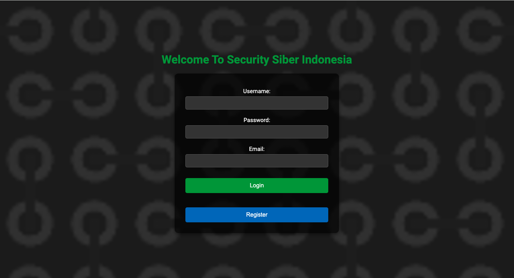
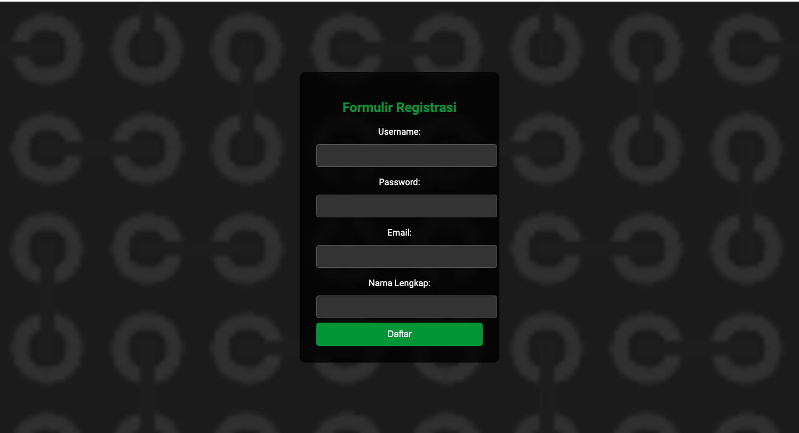
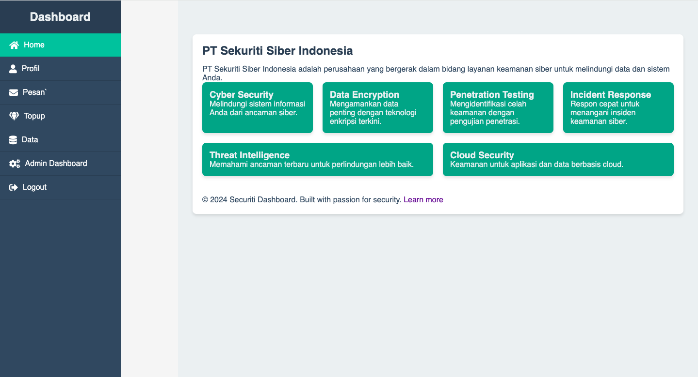
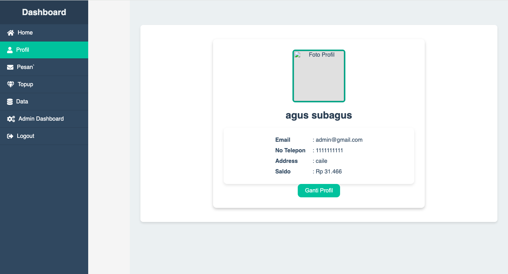
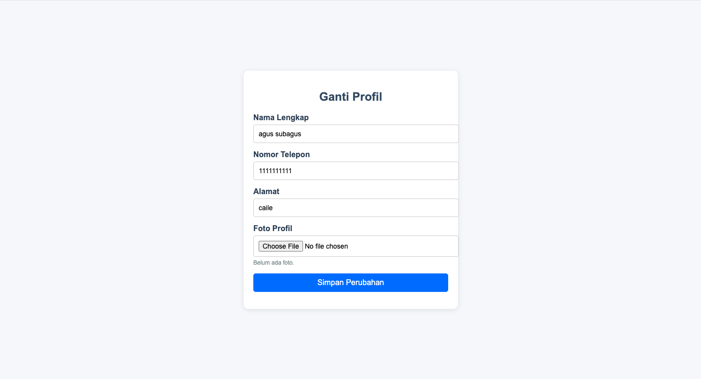
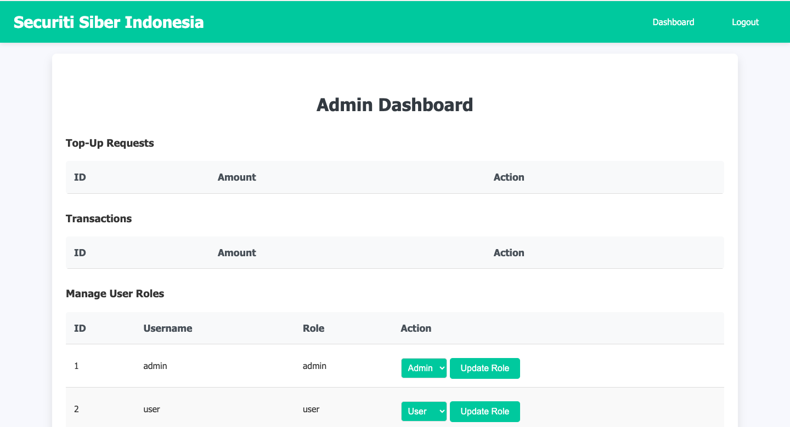
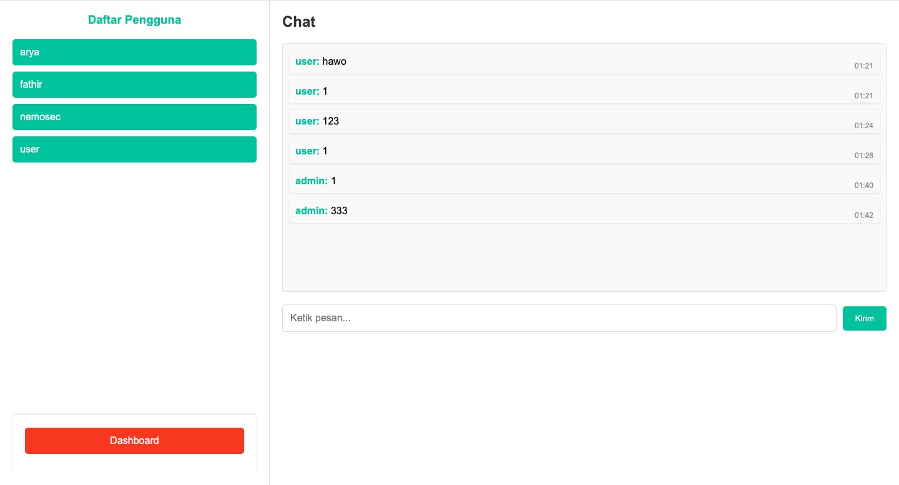
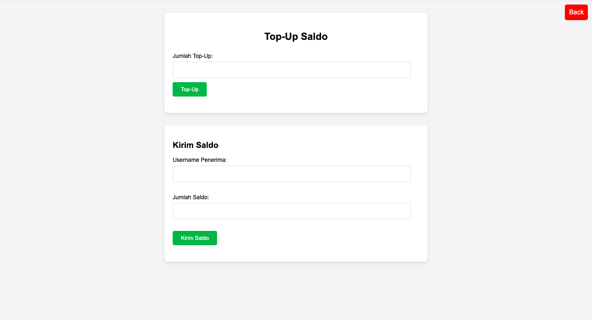
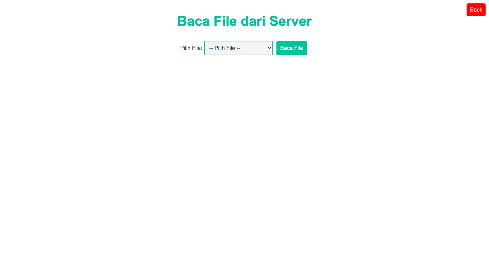

# Login Cyber Security Indonesia 

## Deskripsi
Sistem login ini digunakan untuk mengamankan akses pengguna ke aplikasi Cyber Security Indonesia. Pengguna diminta untuk memasukkan `username`, `password`, dan `email` untuk login. Pengguna yang masuk akan diarahkan ke halaman berbeda berdasarkan peran mereka (admin atau user).

---

## Fungsi Inti
1. **Form Login**:
   - Mengambil `username`, `password`, dan `email` dari input pengguna.
   - Memvalidasi login dengan memeriksa database untuk mencocokkan `username` dan `email`.
   - Membandingkan password yang dimasukkan dengan yang terdaftar di database.
   - Mencatat pengguna dalam session jika login berhasil.
   - Mengarahkan pengguna sesuai dengan peran mereka (admin atau user).

2. **Validasi**:
   - Memastikan `username` dan `email` sudah terdaftar.
   - Memastikan password yang dimasukkan sesuai dengan yang ada di database.
   - Memberikan pesan kesalahan jika input tidak valid atau login gagal.

3. **Tampilan**:
   - Menyediakan antarmuka pengguna yang ramah dengan gaya dan tata letak yang menarik.
   - Menampilkan pesan kesalahan jika terjadi kesalahan pada proses login.

---

## Kredensial Login
Gunakan akun berikut untuk mengakses aplikasi:

### Admin
- **Username:** `admin`
- **Password:** `admin123`
- **Email:** `admin@cybersecurityindonesia.com`

### User
- **Username:** `user`
- **Password:** `user123`
- **Email:** `user@cybersecurityindonesia.com`

> **Catatan:** Kredensial ini hanya untuk keperluan pengujian. Silakan ubah kredensial di database untuk penggunaan di lingkungan produksi.

---

## Instalasi
1. Salin file `login.php` ke dalam direktori yang sesuai di server web Anda.
2. Pastikan database MySQL sudah terhubung dengan aplikasi ini menggunakan file `koneksi.php`.
3. Sesuaikan pengaturan koneksi database di `koneksi.php` dengan pengaturan MySQL Anda.

---

## Penggunaan
1. Buka halaman login di browser web.
2. Masukkan `username`, `password`, dan `email` Anda.
3. Tekan tombol "Login" untuk masuk ke dalam sistem.
4. Jika Anda belum memiliki akun, tekan tombol "Register" untuk membuat akun baru.

---

## Kontak
- **Email:** support@cybersecurityindonesia.com
- **Situs Web:** [Cyber Security Indonesia](https://www.cybersecurityindonesia.com)

# Formulir Registrasi 

## Deskripsi
Script PHP ini digunakan untuk menangani proses registrasi pengguna. Formulir memungkinkan pengguna untuk mendaftar dengan memasukkan username, password, email, dan nama lengkap. Data yang dimasukkan akan disimpan ke dalam database MySQL setelah proses validasi input dan CSRF.

## Instalasi
1. Pastikan Anda sudah memiliki XAMPP atau lingkungan server lokal lainnya yang sudah terinstall.
2. Salin folder ini ke dalam direktori htdocs di folder XAMPP Anda.
3. Jalankan XAMPP dan pastikan Apache dan MySQL sudah berjalan.
4. Buka browser dan akses URL `http://localhost/membuat_laman_login/registrasi.php` untuk menjalankan halaman registrasi.

## Konfigurasi Database
1. Buka phpMyAdmin di XAMPP.
2. Buat database baru dengan nama `membuat_laman_login`.
3. Import file SQL `database.sql` yang ada di folder ini ke dalam database Anda.
4. Sesuaikan konfigurasi database di bagian koneksi PHP (`$host`, `$user`, `$password`, dan `$database`) dengan rincian konfigurasi database Anda.

## Fitur
- **Formulir Registrasi**: Mengizinkan pengguna untuk mendaftar dengan memasukkan informasi akun mereka.
- **Validasi Input**: Memastikan bahwa semua kolom wajib diisi dan password memenuhi syarat minimal 8 karakter dan mengandung angka.
- **CSRF Token**: Menggunakan token CSRF untuk melindungi dari serangan Cross-Site Request Forgery.

## Penggunaan
1. Pengguna mengakses halaman registrasi melalui browser.
2. Mengisi form dengan informasi akun yang diperlukan.
3. Setelah mengklik "Daftar", data akan diperiksa untuk validitas dan jika valid, disimpan ke dalam database.
4. Jika terjadi kesalahan, pesan kesalahan akan ditampilkan di bawah form.

## Catatan
- Pastikan semua input yang diterima melalui formulir sudah divalidasi untuk meningkatkan keamanan aplikasi.
- Gambar latar belakang yang digunakan dalam style form adalah gambar transparan dari `https://www.transparenttextures.com/patterns/connected.png`.

---

# Menu Pilih Admin 

## Deskripsi
Script PHP ini digunakan untuk menyediakan antarmuka admin kepada pengguna yang sudah login dengan peran 'admin'. Pengguna admin dapat memilih untuk diarahkan ke halaman 'hello' atau 'admin dashboard' berdasarkan pilihan yang dipilih melalui form di halaman ini.

## Instalasi
1. Pastikan Anda sudah memiliki XAMPP atau lingkungan server lokal lainnya yang sudah terinstall.
2. Salin folder ini ke dalam direktori htdocs di folder XAMPP Anda.
3. Jalankan XAMPP dan pastikan Apache dan MySQL sudah berjalan.
4. Buka browser dan akses URL `http://localhost/membuat_laman_login/admin_selection.php` untuk menjalankan halaman pilihan redirect.

## Fitur
- **Pilihan Redirect**: Menyediakan dua pilihan bagi admin untuk diarahkan ke halaman 'hello.php' atau 'admin.php'.
- **Validasi Pengguna**: Memastikan bahwa hanya pengguna yang sudah login dengan peran 'admin' yang dapat mengakses halaman ini.
- **Styling Cybersecurity**: Menggunakan CSS untuk memberikan tema cyber security pada halaman dengan latar belakang futuristik dan efek transisi yang menarik.

## Penggunaan
1. Admin yang sudah login dapat memilih salah satu opsi dari halaman ini.
2. Klik pada kotak opsi untuk diarahkan langsung ke halaman yang dipilih.
3. Jika tidak ada pilihan yang valid, pesan kesalahan akan muncul di halaman.

## Catatan
- Pastikan semua input divalidasi untuk keamanan aplikasi dan perlindungan terhadap serangan yang mungkin terjadi.
- Penataan tampilan menggunakan CSS untuk menciptakan antarmuka yang menarik dan mudah digunakan.

## Perizinan
Distribusi bebas.

---

# Menu Dashboard 

## Deskripsi
Dashboard Securiti Siber Indonesia adalah aplikasi berbasis web yang menyediakan antarmuka pengguna untuk pengelolaan akun pengguna dan informasi terkait layanan keamanan siber. Aplikasi ini menggunakan PHP dan MySQL untuk pengelolaan data pengguna dan transaksi coin. Dashboard ini menyediakan fitur-fitur berikut:

- **Login**: Proses autentikasi menggunakan username, password, dan email dari database.
- **Dashboard**: Menyediakan navigasi sidebar untuk akses mudah ke halaman Home, Profil, Pesan, Topup, Data, dan Admin Dashboard (untuk pengguna admin).
- **Profil Pengguna**: Menampilkan informasi pribadi pengguna, seperti email, nomor telepon, alamat, dan saldo coin.
- **Layanan Siber**: Menyediakan informasi tentang berbagai layanan keamanan siber yang ditawarkan.
- **Interaksi Pengguna**: Mendukung navigasi antar halaman menggunakan hash URL, dengan mengubah URL hash tanpa mereload halaman.

## Instalasi
1. **Persyaratan**:
   - PHP versi 7.4 atau lebih tinggi.
   - MySQL untuk database.
   - XAMPP atau server web lain yang mendukung PHP dan MySQL.
   
2. **Langkah-langkah instalasi**:
   - Salin semua file ke dalam direktori htdocs di XAMPP atau direktori root server web lainnya.
   - Konfigurasikan file `koneksi.php` untuk menghubungkan ke database MySQL.
   - Buka aplikasi di browser Anda dengan membuka `index.php`.

## Penggunaan
- Akses halaman login untuk masuk ke dalam aplikasi.
- Setelah login, pengguna dapat mengakses dashboard, melihat dan mengelola profil pengguna, mengirim pesan, melakukan topup, dan mengelola data.
- Pengguna admin dapat mengakses halaman Admin Dashboard untuk mengelola data lebih lanjut.

## Fitur Tambahan
- **Tombol logout**: Memungkinkan pengguna untuk keluar dari sistem.
- **Pengecekan session**: Mengarahkan pengguna ke halaman login jika tidak ada session yang ditemukan.
- **Animasi dan transisi**: Memperbaiki pengalaman pengguna dengan animasi dan transisi yang halus saat mengganti halaman menggunakan hash URL.

## Pengembangan
- Script menggunakan PDO untuk mempersiapkan statement dan menghindari SQL injection.
- Semua input dari pengguna sudah divalidasi untuk mencegah potensi serangan keamanan.
- Terdapat struktur kode yang modular untuk pengelolaan data dan tampilan.

-----

# Menu Profil Pengguna

## Deskripsi
Script PHP ini digunakan untuk mengubah informasi profil pengguna yang sudah login. Pengguna dapat mengedit nama lengkap, nomor telepon, alamat, dan foto profil mereka. Data disimpan dalam database MySQL.

## Instalasi
1. Pastikan Anda sudah memiliki XAMPP atau lingkungan server lokal lainnya yang sudah terinstall.
2. Salin folder ini ke dalam direktori htdocs di folder XAMPP Anda.
3. Jalankan XAMPP dan pastikan Apache dan MySQL sudah berjalan.
4. Buka browser dan akses URL `http://localhost/membuat_laman_login/ganti_profil.php` untuk menjalankan halaman pengaturan profil.

## Konfigurasi Database
1. Buka phpMyAdmin di XAMPP.
2. Buat database baru dengan nama `membuat_laman_login`.
3. Import file SQL `database.sql` yang ada di folder ini ke dalam database Anda.
4. Sesuaikan konfigurasi database di bagian koneksi PHP (`$host`, `$user`, `$password`, dan `$database`) dengan rincian konfigurasi database Anda.

## Fitur
- **Edit Profil**: Mengubah informasi pengguna termasuk nama lengkap, nomor telepon, alamat, dan foto profil.
- **Upload Foto**: Memungkinkan pengguna untuk mengganti foto profil mereka.
- **Pengaturan Input**: Validasi input untuk memastikan semua data yang dimasukkan valid.

## Penggunaan
1. Pengguna harus login terlebih dahulu untuk mengakses halaman ini.
2. Pada halaman ganti profil, pengguna dapat mengisi atau mengedit detail profil mereka.
3. Jika pengguna memilih untuk mengganti foto profil, mereka bisa mengunggah file gambar (JPEG, PNG, GIF).
4. Setelah mengisi form dan mengklik "Simpan Perubahan", data akan diperbarui dalam database dan pengguna akan diarahkan ke halaman utama aplikasi.

## Catatan
- Pastikan semua validasi input diterapkan untuk menghindari input yang salah dan meningkatkan keamanan.
- Gambar yang diunggah harus dalam format yang diperbolehkan (JPEG, PNG, GIF).

## Perizinan
Distribusi bebas.

---

# Menu Ganti Profil 

## Deskripsi
Script PHP ini digunakan untuk menangani pengubahan profil pengguna. Pengguna yang sudah login dapat mengakses halaman ini untuk memperbarui informasi profil mereka seperti nama lengkap, nomor telepon, alamat, dan foto profil. Perubahan yang disimpan akan diperbarui di database MySQL.

## Instalasi
1. Pastikan Anda sudah memiliki XAMPP atau lingkungan server lokal lainnya yang sudah terinstall.
2. Salin folder ini ke dalam direktori htdocs di folder XAMPP Anda.
3. Jalankan XAMPP dan pastikan Apache dan MySQL sudah berjalan.
4. Buka browser dan akses URL `http://localhost/membuat_laman_login/ubah_profil.php` untuk menjalankan halaman pengaturan profil.

## Konfigurasi Database
1. Buka phpMyAdmin di XAMPP.
2. Buat database baru dengan nama `membuat_laman_login`.
3. Import file SQL `database.sql` yang ada di folder ini ke dalam database Anda.
4. Sesuaikan konfigurasi database di bagian koneksi PHP (`$host`, `$user`, `$password`, dan `$database`) dengan rincian konfigurasi database Anda.

## Fitur
- **Pengaturan Profil**: Mengizinkan pengguna untuk memperbarui nama lengkap, nomor telepon, alamat, dan foto profil.
- **Pengunggahan Foto Profil**: Memungkinkan pengguna untuk mengganti foto profil mereka dengan file gambar yang valid (JPEG, PNG, GIF).
- **Validasi Input**: Memastikan semua input dan unggahan file sudah sesuai dengan kriteria sebelum disimpan ke database.

## Penggunaan
1. Pengguna yang sudah login mengakses halaman pengaturan profil.
2. Pengguna dapat mengisi atau memperbarui informasi profil mereka melalui formulir yang disediakan.
3. Jika foto profil diganti, unggah file gambar yang valid.
4. Setelah mengklik "Simpan Perubahan", data akan diperbarui di database dan pengguna akan diarahkan kembali ke halaman utama.

## Catatan
- Gambar latar belakang yang digunakan dalam style form adalah gambar transparan dari `https://www.transparenttextures.com/patterns/connected.png`.
- Pastikan semua input divalidasi untuk keamanan aplikasi dan perlindungan terhadap serangan yang mungkin terjadi.

## Perizinan
Distribusi bebas.

---

# Admin Dashboard 

## Deskripsi
Script ini merupakan halaman dashboard admin untuk aplikasi "Securiti Siber Indonesia". Halaman ini menyediakan berbagai fitur manajemen seperti pengelolaan permintaan top-up, transaksi, dan peran pengguna.

## Fitur Utama
- **Dashboard Admin**: Halaman utama dengan menu navigasi untuk Dashboard, Logout, dan manajemen data.
- **Pengelolaan Top-Up Requests**:
  - Menampilkan daftar permintaan top-up yang belum diverifikasi.
  - Opsi untuk "Approve" atau "Reject" permintaan top-up.
- **Pengelolaan Transaksi**:
  - Menampilkan daftar transaksi yang belum diverifikasi.
  - Opsi untuk "Approve" atau "Reject" transaksi.
- **Pengelolaan Peran Pengguna**:
  - Menampilkan daftar pengguna dengan ID, nama pengguna, dan peran.
  - Opsi untuk memperbarui peran pengguna antara 'user' dan 'admin'.

## Prasyarat
- Server web dengan PHP dan MySQL.
- Akses ke database MySQL yang terhubung dengan aplikasi.

## Penggunaan
1. Pastikan Anda memiliki akses ke server web yang mendukung PHP.
2. Konfigurasikan file `config.php` dengan pengaturan database yang sesuai.
3. Akses halaman ini melalui browser di `http://[your-server]/admin_dashboard.php`.

## Instalasi
1. Salin semua file ke direktori root server web Anda.
2. Sesuaikan `config.php` dengan informasi database Anda.
3. Buka halaman `http://[your-server]/admin_dashboard.php` dalam browser untuk mengakses dashboard admin.

## Pengembangan
- `updateRoleInProject($id, $new_role, $conn)`: Fungsi untuk memperbarui peran pengguna.
- Opsi "Approve" dan "Reject" pada permintaan top-up dan transaksi menggunakan metode POST.
- Penggunaan session untuk memverifikasi apakah pengguna sudah login dan memiliki peran 'admin'.

## Kontak
- Email: [your-email@example.com]
- GitHub: [your-github-username]

----

# Menu Update Role 

## Deskripsi
Script PHP ini digunakan oleh admin untuk mengelola peran pengguna di aplikasi. Admin dapat memperbarui peran pengguna dari 'user' ke 'admin' atau sebaliknya melalui formulir yang disediakan. Script ini menggunakan koneksi database MySQL dengan PDO untuk melakukan perubahan data.

## Instalasi
1. Pastikan Anda sudah memiliki XAMPP atau lingkungan server lokal lainnya yang sudah terinstall.
2. Salin folder ini ke dalam direktori htdocs di folder XAMPP Anda.
3. Jalankan XAMPP dan pastikan Apache dan MySQL sudah berjalan.
4. Buka browser dan akses URL `http://localhost/membuat_laman_login/manajemen_peran.php` untuk menjalankan halaman manajemen peran pengguna.

## Konfigurasi Database
1. Buka phpMyAdmin di XAMPP.
2. Buat database baru dengan nama `membuat_laman_login`.
3. Import file SQL `database.sql` yang ada di folder ini ke dalam database Anda.
4. Sesuaikan konfigurasi database di bagian koneksi PHP (`$host`, `$db`, `$user`, dan `$pass`) dengan rincian konfigurasi database Anda.

## Fitur
- **Manajemen Peran Pengguna**: Mengizinkan admin untuk mengubah peran pengguna dari 'user' ke 'admin' atau sebaliknya.
- **Validasi Input**: Memastikan ID pengguna dan peran baru valid sebelum melakukan pembaruan di database.
- **Pengalihan Arah setelah Sukses**: Setelah berhasil memperbarui peran, pengguna diarahkan ke halaman dashboard dengan parameter query untuk menunjukkan perubahan.

## Penggunaan
1. Admin yang sudah login dapat mengakses halaman manajemen peran pengguna.
2. Admin mengisi ID pengguna yang ingin diubah peran dan memilih peran baru dari dropdown yang tersedia.
3. Setelah mengklik "Simpan Perubahan", perubahan akan disimpan di database dan admin akan diarahkan ke dashboard.

## Catatan
- Pastikan semua input divalidasi untuk keamanan aplikasi dan perlindungan terhadap serangan yang mungkin terjadi.
- Pesan kesalahan akan muncul jika ada masalah selama proses update peran.

## Perizinan
Distribusi bebas.

----

# Menu Massage

## Deskripsi
Script PHP ini digunakan untuk membuat aplikasi chatting antar pengguna. Pengguna dapat memilih teman untuk memulai percakapan, mengirim pesan, dan melihat pesan-pesan yang diterima. Data pengguna dan pesan disimpan dalam database MySQL.

## Instalasi
1. Pastikan Anda sudah memiliki XAMPP atau lingkungan server lokal lainnya yang sudah terinstall.
2. Salin folder ini ke dalam direktori htdocs di folder XAMPP Anda.
3. Jalankan XAMPP dan pastikan Apache dan MySQL sudah berjalan.
4. Buka browser dan akses URL `http://localhost/membuat_laman_login/` untuk menjalankan aplikasi.

## Konfigurasi Database
1. Buka phpMyAdmin di XAMPP.
2. Buat database baru dengan nama `membuat_laman_login`.
3. Import file SQL `database.sql` yang ada di folder ini ke dalam database Anda.
4. Sesuaikan konfigurasi database di bagian koneksi PHP (`$host`, `$user`, `$password`, dan `$database`) dengan rincian konfigurasi database Anda.

## Fitur
- **Daftar Pengguna**: Menampilkan daftar pengguna lain.
- **Pesan**: Mengirim dan menerima pesan antara pengguna.
- **Form Pesan**: Input dan kirim pesan dari pengguna yang dipilih.
- **Perbarui Pesan**: Memuat pesan baru secara otomatis tanpa refresh halaman.

## Penggunaan
1. Pastikan pengguna sudah login. Jika belum, akan diarahkan ke halaman login.
2. Setelah login, pengguna dapat memilih teman dari daftar yang tersedia.
3. Setelah memilih teman, pengguna dapat mulai mengirim pesan di chat box.
4. Pesan baru dapat dikirim menggunakan form pesan di bagian bawah.

## Pengembangan
- Gunakan PHP dan MySQL untuk mengelola data pengguna dan pesan.
- Formulir pesan menggunakan metode POST untuk mengirim data ke `send_message.php`.
- Menggunakan JavaScript Fetch API untuk memperbarui pesan secara real-time tanpa perlu refresh halaman.

## Catatan
- Pastikan keamanan login dan validasi input sudah diterapkan untuk mencegah serangan SQL injection atau XSS.
- Sesuaikan tampilan dan tata letak sesuai kebutuhan aplikasi Anda.

## Perizinan
Ini proyek pribadi tanpa perizinan untuk penggunaan komersial tanpa izin tertulis.

---

# Send Massage 

## Deskripsi
Script PHP ini digunakan untuk menangani pengiriman pesan antar pengguna di aplikasi. Pengguna yang sudah login dapat mengirim pesan kepada penerima tertentu melalui ID penerima yang dipilih.

## Instalasi
1. Pastikan Anda sudah memiliki XAMPP atau lingkungan server lokal lainnya yang sudah terinstall.
2. Salin folder ini ke dalam direktori htdocs di folder XAMPP Anda.
3. Jalankan XAMPP dan pastikan Apache dan MySQL sudah berjalan.
4. Buka browser dan akses URL `http://localhost/membuat_laman_login/pengiriman_pesan.php` untuk menjalankan halaman pengiriman pesan.

## Konfigurasi Database
1. Buka phpMyAdmin di XAMPP.
2. Buat database baru dengan nama `membuat_laman_login`.
3. Import file SQL `database.sql` yang ada di folder ini ke dalam database Anda.
4. Sesuaikan konfigurasi database di bagian koneksi PHP (`$host`, `$user`, `$password`, dan `$database`) dengan rincian konfigurasi database Anda.

## Fitur
- **Pengiriman Pesan**: Memungkinkan pengguna untuk mengirim pesan kepada pengguna lain berdasarkan ID penerima yang dipilih.
- **Validasi Pengguna**: Memastikan bahwa hanya pengguna yang sudah login dapat mengirim pesan.
- **Pengambilan ID Pengirim**: Mengambil ID pengirim dari username yang sedang login.
- **Penyimpanan Pesan**: Menyimpan pesan ke dalam database dengan informasi pengirim dan penerima.

## Penggunaan
1. Pengguna yang sudah login mengakses halaman pengiriman pesan.
2. Pengguna memilih ID penerima dari dropdown yang tersedia.
3. Pengguna menulis pesan dalam form yang tersedia.
4. Setelah mengklik tombol "Kirim", pesan akan disimpan ke database.

## Catatan
- Pastikan semua input divalidasi untuk keamanan aplikasi dan perlindungan terhadap serangan yang mungkin terjadi.
- Pesan kesalahan akan muncul jika ada masalah selama proses pengiriman pesan.

## Perizinan
Distribusi bebas.

---

#  Fetch Message  

## Deskripsi
Script PHP ini digunakan untuk menampilkan pesan antara pengguna yang sudah login dengan pengguna lain berdasarkan ID penerima yang dipilih. Pengguna yang sudah login dapat melihat pesan yang telah dikirim dan diterima dengan urutan waktu yang terbaru.

## Instalasi
1. Pastikan Anda sudah memiliki XAMPP atau lingkungan server lokal lainnya yang sudah terinstall.
2. Salin folder ini ke dalam direktori htdocs di folder XAMPP Anda.
3. Jalankan XAMPP dan pastikan Apache dan MySQL sudah berjalan.
4. Buka browser dan akses URL `http://localhost/membuat_laman_login/lihat_pesan.php?receiver_id=<ID PENERIMA>` untuk menjalankan halaman melihat pesan.

## Konfigurasi Database
1. Buka phpMyAdmin di XAMPP.
2. Buat database baru dengan nama `membuat_laman_login`.
3. Import file SQL `database.sql` yang ada di folder ini ke dalam database Anda.
4. Sesuaikan konfigurasi database di bagian koneksi PHP (`$host`, `$user`, `$password`, dan `$database`) dengan rincian konfigurasi database Anda.

## Fitur
- **Lihat Pesan**: Memungkinkan pengguna untuk melihat pesan-pesan antara dirinya dan pengguna lain berdasarkan ID penerima yang dipilih.
- **Ambil ID Pengirim**: Mengambil ID pengirim dari username yang sedang login.
- **Menampilkan Pesan**: Menampilkan pesan yang dikirim dan diterima dengan urutan waktu yang terbaru.
- **Validasi Pengguna**: Memastikan bahwa hanya pengguna yang sudah login yang dapat melihat pesan.

## Penggunaan
1. Pengguna yang sudah login mengakses halaman lihat pesan.
2. Pengguna memasukkan ID penerima pesan dalam URL.
3. Pesan-pesan yang dikirim dan diterima antara pengguna yang login dan pengguna dengan ID tersebut akan ditampilkan secara berurutan berdasarkan waktu.

## Catatan
- Pastikan semua input divalidasi untuk keamanan aplikasi dan perlindungan terhadap serangan yang mungkin terjadi.
- Format tampilan pesan disesuaikan dengan tampilan antarmuka yang diinginkan (CSS).
- Pesan kesalahan akan muncul jika terjadi masalah dalam proses pengambilan atau tampilan pesan.

## Perizinan
Distribusi bebas.

---

# Menu Kirim Saldo & Top-Up Saldo 

## Deskripsi
Script PHP ini memungkinkan pengguna untuk melakukan Top-Up saldo atau mengirim saldo ke pengguna lainnya dalam aplikasi. Hanya pengguna yang sudah login yang dapat mengakses fitur ini. Proses dilakukan dengan memvalidasi input, menyimpan permintaan ke database, dan memverifikasi transaksi sebelum menyelesaikannya.

## Fitur
1. **Top-Up Saldo**:
   - Mengambil jumlah saldo yang ingin di-top-up dari form input.
   - Memastikan jumlah top-up lebih besar dari nol.
   - Menyimpan permintaan top-up ke dalam database dengan status 'pending'.

2. **Kirim Saldo**:
   - Mengambil username penerima dan jumlah saldo dari form input.
   - Memastikan jumlah saldo dan username penerima valid.
   - Mengupdate saldo proyek pengirim dan penerima di database.
   - Menyimpan transaksi kirim saldo ke dalam database dengan status 'pending' untuk verifikasi admin.

## Instalasi
1. Salin file ini ke dalam direktori htdocs di server lokal (misalnya XAMPP).
2. Buka file `koneksi.php` dan pastikan pengaturan koneksi database sesuai dengan setup Anda.
3. Jalankan XAMPP dan pastikan Apache dan MySQL sudah berjalan.
4. Akses URL `http://localhost/nama_proyek/kirim_topup.php` di browser untuk menggunakan halaman Kirim Saldo & Top-Up.

## Penggunaan
1. Login sebagai pengguna yang terdaftar.
2. Pilih opsi "Top-Up Saldo" untuk menambah saldo proyek.
3. Atau pilih opsi "Kirim Saldo" untuk mengirim saldo ke pengguna lain dengan memasukkan username penerima dan jumlah saldo.
4. Semua transaksi akan menunggu verifikasi admin sebelum diselesaikan.

## Catatan
- Pastikan semua input di-form validasi untuk keamanan aplikasi.
- Semua transaksi yang dilakukan akan disimpan dalam database dengan status 'pending' hingga diverifikasi oleh admin.

## Perizinan
Distribusi bebas.

----

# Menu Data 

## Deskripsi
Script PHP ini memungkinkan pengguna untuk membaca file dari direktori server. Pengguna dapat memilih file dari daftar yang ada di dalam direktori dan menampilkannya dalam bentuk teks atau tabel jika file tersebut berformat CSV.

## Fitur
1. **Pemilihan File**:
   - Pengguna dapat memilih file dari dropdown list yang berisi daftar file yang ada di direktori.
   - File yang dipilih akan ditampilkan isinya dalam format teks atau tabel, tergantung pada jenis file.

2. **Menampilkan Isi File**:
   - Jika file adalah CSV, tampilkan data dalam format tabel dengan header dan baris data.
   - Jika file bukan CSV, tampilkan isi file sebagai teks biasa menggunakan elemen `<pre>`.

3. **Pengelolaan Kesalahan**:
   - Tampilakan pesan error jika file yang dipilih tidak ditemukan.

## Instalasi
1. Salin file ini ke dalam direktori htdocs di server lokal (misalnya XAMPP).
2. Buka file `koneksi.php` dan pastikan pengaturan koneksi database sesuai dengan setup Anda.
3. Jalankan XAMPP dan pastikan Apache dan MySQL sudah berjalan.
4. Akses URL `http://localhost/nama_proyek/baca_file.php` di browser untuk menggunakan aplikasi Baca File dari Server.

## Penggunaan
1. Pilih file dari dropdown list.
2. Klik tombol "Baca File" untuk menampilkan isi file yang dipilih.
3. Jika file adalah CSV, tampilkan dalam format tabel.
4. Jika file bukan CSV, tampilkan isi file sebagai teks biasa.

## Catatan
- Pastikan semua file yang ada di direktori sudah memiliki izin yang tepat untuk dibaca oleh aplikasi.
- Hanya file dengan ekstensi CSV yang akan ditampilkan dalam format tabel.

## Perizinan
Distribusi bebas.

---

# Log Out 

## Deskripsi
Script PHP ini digunakan untuk menghapus sesi pengguna dan mengakhiri sesi yang sedang berlangsung. Ini membersihkan semua variabel sesi, menghapus cookie sesi, dan kemudian menghapus sesi itu sendiri.

## Fitur
1. **Menghapus Data Sesi**:
   - Menghapus semua variabel sesi yang ada dengan mengisi array sesi dengan nilai kosong.
   
2. **Menghapus Cookie Sesi**:
   - Menghapus cookie sesi dengan `setcookie()` menggunakan nama sesi dan menetapkan waktunya ke waktu di masa lalu.
   
3. **Menghancurkan Sesi**:
   - Menghancurkan sesi menggunakan `session_destroy()`.
   
4. **Redirect**:
   - Setelah menghancurkan sesi, pengguna akan diarahkan ke halaman `index.php`.

## Instalasi
Tidak diperlukan instalasi khusus. Salin script ini ke dalam folder aplikasi Anda.

## Penggunaan
- Script ini bisa dipanggil di halaman mana pun sebagai bagian dari proses log out untuk mengakhiri sesi pengguna.
- Script ini akan menghapus sesi pengguna, menghapus cookie sesi, dan kemudian mengarahkan pengguna ke halaman `index.php`.

## Catatan
- Pastikan bahwa `index.php` adalah halaman utama tempat pengguna diarahkan setelah logout.
- Gunakan script ini dengan hati-hati pada aplikasi dengan multi-user untuk menghindari masalah akses silang.

